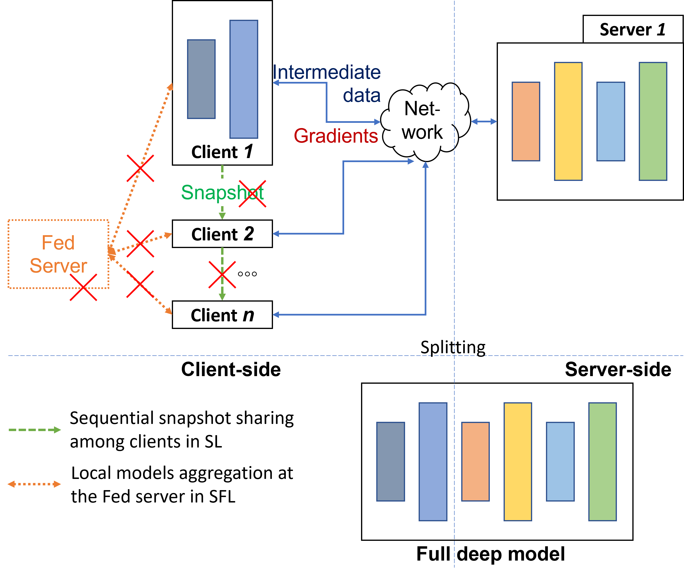

## Split Learning without Local Weight Sharing to Enhance Client-side Data Privacy

**Now available**
- Our proposed privacy-enhanced SL (P-SL) model (see Figure)
- Experiments on P-SL with various datasets under different data distributions
- Experiments on P-SL in scalable and dynamic environments

**Repository overview**
- `data/` - Contains recorded accuracy results from various experiments and the ECG dataset in `hdf5` format.
- `library/` - includes source code in `ipynb` format for:
  - `Network.ipynb` - Implementation of the proposed P-SL model
  - `Dataset.ipynb` - Functions for training dataset loading
  - `Training.ipynb` - Training scripts for the networks.
- `MultipleClients/` - Experiments with P-SL using 6 clients on CIFAR10, Fashion, and ECG datasets under different data distributions (IID, Non-IID, and imbalanced).
  - `RandomOrder/` - Results when clients are randomly selected each round.
- `MultipleServers/` - Experiments with multiple servers (ranging from 2 to 20) for parallel client training.
- `WithNewcomers/` Experiments with newly participating clients on CIFAR10 and Fashion datasets.
- `RelatedWork/` - Comparisons with other privacy-preserving methods, including differential privacy, DISCO, and ResSFL.

Our code is implemented and tested using PyTorch on Google Colab Notebook with GPU acceleration enabled. The following packages are used in our implementation:
- `torch==2.5.1+cu124`
- `torchvision==0.20.1+cu124`
- `pytorch-msssim==1.0.0`
- `python==3.11.11`
